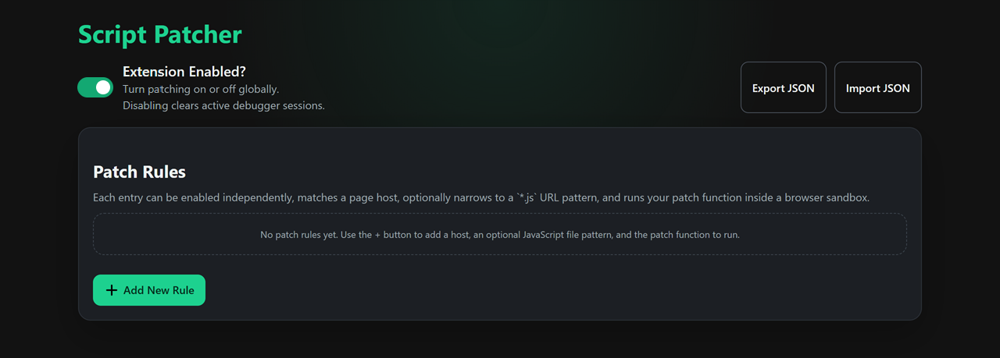
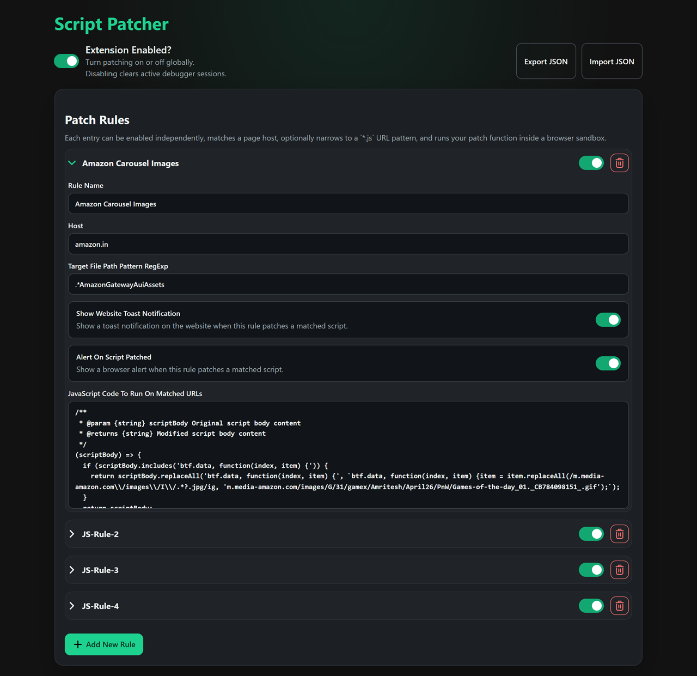
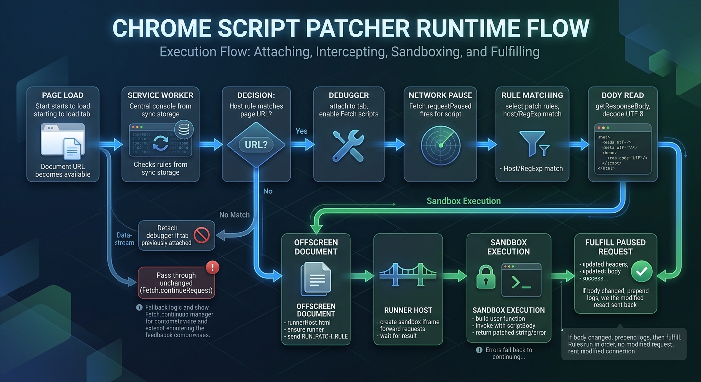
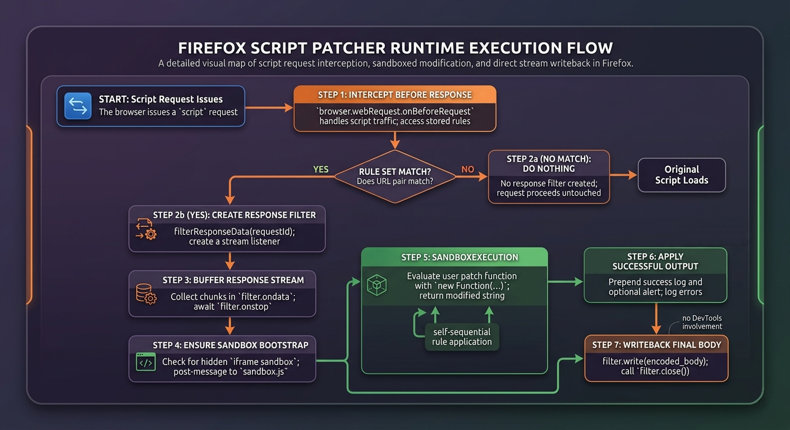

# [Script Patcher](https://github.com/AkshayBhanawala/BrowserExtention.ScriptPatcher)


Patch matched JavaScript files with sandboxed user-defined rules.

Script Patcher is a Manifest V3 browser extension project for Chrome and Firefox. It lets you define host-based patch rules, optionally narrow them to a JavaScript file URL pattern, and transform the response body before the script continues running in the page.



## Features

- Match rules by page host such as `example.com` or `*.example.com`
- Optionally filter only specific JavaScript request URLs with a regular expression
- Run user-defined patch functions in a sandboxed environment
- Toggle an alert banner before a patched script continues
- Optionally inject an in-page notification banner for all patched script of the page
- Import and export extension config as JSON
- Build Chrome and Firefox distributions from one repository

## Project Structure

```text
.
|-- Chrome/             # Chrome extension source
|-- FireFox/            # Firefox extension source
|-- dist/               # Build output
|-- scripts/            # Build scripts
|-- docs/               # ReadMe resources
|-- package.json        # Project metadata and dependencies
```

## How It Works

1. The extension watches tabs whose URL matches one of your configured hosts.
2. When a matching `.js` response is detected, the extension checks your optional URL pattern.
3. Your patch function receives the original script body as a string.
4. If your function returns a different string, the extension serves that patched body instead of the original response.

Chrome uses the `debugger` API plus an offscreen document to intercept and rewrite script responses. Firefox uses `webRequest`, `webRequestBlocking`, and `webRequestFilterResponse` for the same goal.



## Rule Format

Each rule contains:

- `name`: Friendly label shown in the UI
- `host`: Hostname pattern to match against the current page URL
- `pattern`: Optional regular expression matched against the requested JavaScript URL
- `alertOnScriptPatched`: Whether to show a browser alert when the rule patches a script
- `webpageNotificationOnScriptPatched`: Whether to inject the webpage notification helper when the rule patches a script
- `script`: A function that receives the original script body and returns the patched body

Example rule:

```js
/**
 * @param {string} scriptBody Original script body content
 * @returns {string} Modified script body content
 */
(scriptBody) => {
	if (scriptBody.includes('search-string')) {
		return scriptBody.replaceAll('search-string', 'replace-string');
	}

	return scriptBody;
}
```

Example config export:

```json
{
  "rules": [
    {
      "name": "Replace feature flag",
      "host": "*.example.com",
      "pattern": "/assets/.*\\.js$",
      "alertOnScriptPatched": false,
      "webpageNotificationOnScriptPatched": true,
      "script": "(scriptBody) => scriptBody.replaceAll('__FLAG__', 'enabled')"
    }
  ]
}
```

## Install For Development

### Requirements

- VS Code
- Node.js 18+
- A Chromium-based browser for Chrome testing
- Firefox 140+ for Firefox testing
- VS Code Extension [Run on Save](https://marketplace.visualstudio.com/items?itemName=emeraldwalk.RunOnSave) (For automatically running tasks on save for minifying and copying assets)

### Install Dependencies

```bash
npm install
```

### Build

Build both extensions:

```bash
npm run build
```

Build only Chrome:

```bash
npm run build:chrome
```

Build only Firefox:

```bash
npm run build:firefox
```

The build script copies the browser-specific source folders into `dist/chrome` and `dist/firefox`, and writes a `dist/build-manifest.json` summary file.

## Load The Extension

### Chrome

1. Open `chrome://extensions`
2. Enable Developer mode
3. Choose `Load unpacked`
4. Select `dist/chrome` or the `Chrome` folder

### Firefox

1. Open `about:debugging`
2. Choose `This Firefox`
3. Click `Load Temporary Add-on`
4. Select the `manifest.json` file from `dist/firefox` or `FireFox`

## Using Script Patcher

1. Open the extension options page
2. Toggle `Alert On Script Patched` if you want a visible notice before patched code runs
3. Add a new rule
4. Enter a host such as `example.com` or `*.example.com`
5. Optionally enter a JavaScript URL pattern regular expression
6. Paste a patch function that returns a modified script string
7. Save happens automatically while editing
8. Use `Export JSON` and `Import JSON` to move configurations between browsers or machines

### Chrome Patch Flow



### Firefox Patch Flow



## Permissions

### Chrome

- `debugger`: intercept and fulfill script responses
- `tabs`: detect matching tabs and URLs
- `storage`: persist rules and settings
- `offscreen`: run patch code in an offscreen sandbox host
- `*://*/*`: inspect requests on pages you choose to target

### Firefox

- `webRequest`, `webRequestBlocking`, `webRequestFilterResponse`: intercept and rewrite script responses
- `tabs`: detect active tab URLs
- `storage`: persist rules and settings
- `*://*/*`: inspect requests on pages you choose to target

## Limitations

- Only JavaScript files whose pathname ends with `.js` are patched
- Invalid regular expressions or patch functions can cause a rule to fail
- Chrome can conflict with other tools already attached through the DevTools debugger
- Rewriting third-party scripts can break page behavior if the patch is unsafe
- Firefox support depends on APIs available in modern Firefox releases


## Privacy Policy
[Find it HERE](https://rawcdn.githack.com/AkshayBhanawala/BrowserExtention.ScriptPatcher/refs/heads/master/docs/PrivacyPolicy.html)

## License

No license file is currently included in this repository.
